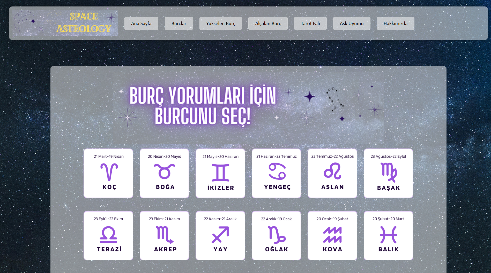
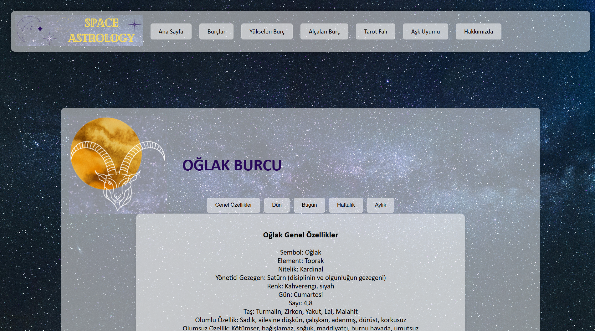
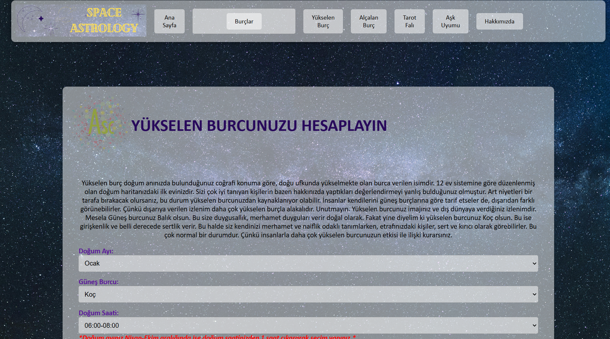
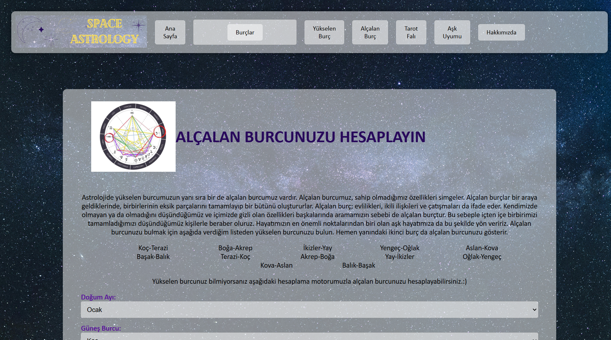
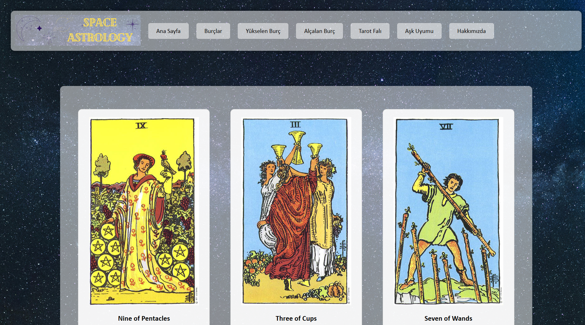
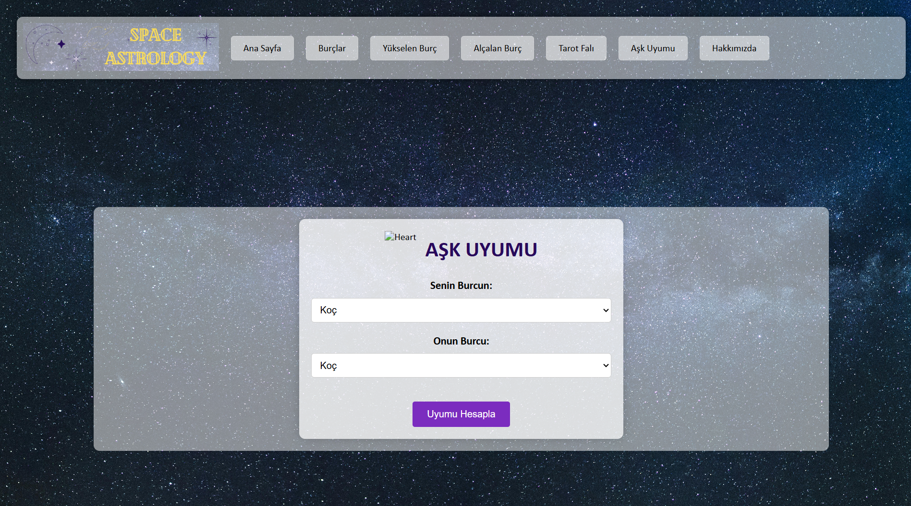
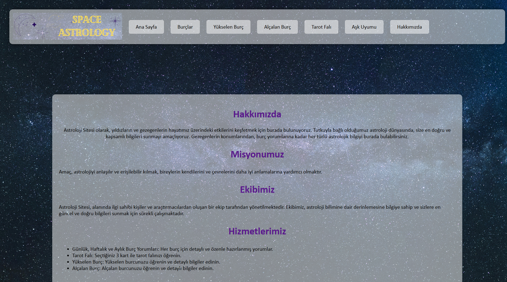

# 🔮 Astrology Website

Astrology Web App is a feature-rich astrology application built with **ASP.NET Web Forms**. Users can explore daily, weekly, and monthly horoscopes, calculate their rising and descending signs, draw tarot cards, and check compatibility between two zodiac signs.

All horoscope data is parsed from `ntv.com.tr` and stored in an **Access database**, ensuring users always receive up-to-date astrology insights.

---

🎥 **Demo Video:** [Watch on YouTube](https://youtu.be/MKj5RPmgmb4)

---

## 🌟 Features

- 📰 **Horoscope Feed:** General traits, yesterday’s, today’s, weekly, and monthly horoscopes for each zodiac sign.
- 🌐 **Web Scraping:** Automatically parses and stores content from  
  `https://www.ntv.com.tr/astroloji-ve-burclar.rss`.
- 🖼️ **Visual Zodiac Selection:** All signs are presented with icons on the homepage for easy access.
- ⬆️ **Rising Sign Calculator:** Calculates the user's rising sign based on birth month, solar month, and birth time range.
- ⬇️ **Descending Sign Calculator:** A dedicated panel for calculating your descending zodiac sign.
- 🃏 **Tarot:** Users pick 3 random tarot cards and receive mystical insights with card interpretations.
- ❤️ **Love Compatibility:** Select two zodiac signs to see their love compatibility score.
- ℹ️ **About Page:** Displays mission, team, and service-related information as a typical About Us section.

---

## 🧰 Technologies Used

- **ASP.NET Web Forms (C#)**
- **Microsoft Access (.accdb / .mdb)**
- **Web Scraping (RSS-based)**
- **Randomization Logic (for tarot and compatibility)**

---
## 🚀 How to Run Locally

1. Open the solution in **Visual Studio**.
2. Make sure you have the required **.NET Framework** installed (e.g., .NET Framework 4.x).
3. Ensure **Microsoft Access Database Engine** is installed.
4. Build and run the project using IIS Express.
5. The home page will show zodiac selections.

---

## 🖼️ Screenshots

### 🌟 Homepage

### ♈ Horoscope Detail Page

### ⬆️ Rising / Descending Sign Pages

### 🃏 Tarot Reading Page

### ❤️ Love Compatibility Page

### ℹ️ About Us Page

